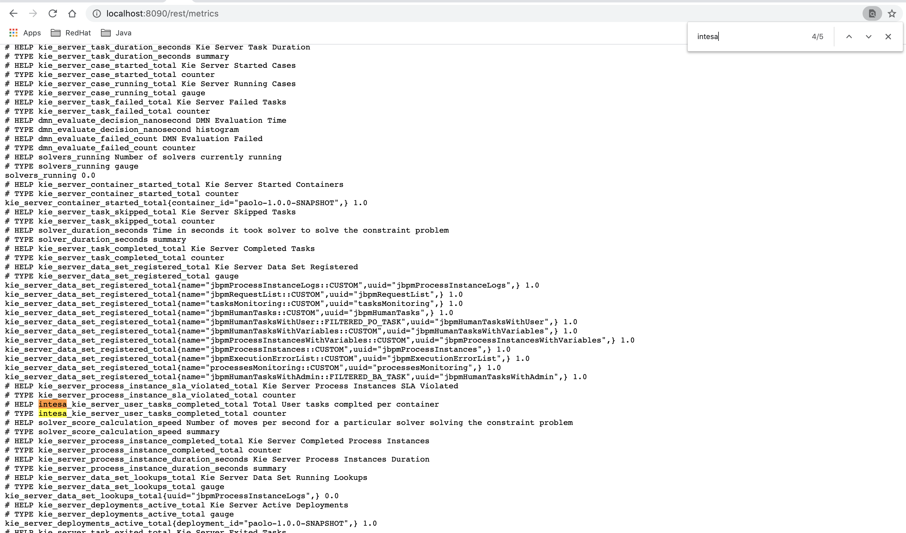

Introduction
=============
Prometheus is an open-source systems monitoring toolkit that you can use with Red Hat Process Automation Manager  to collect and store metrics related to the execution of business rules, processes, Decision Model and Notation (DMN) models, and other Red Hat Process Automation Manager assets. You can access the stored metrics through a REST API call to the KIE Server, through the Prometheus expression browser, or using a data-graphing tool such as Grafana.

For additional infromation configure Prometheus metrics monitoring refer [here](https://access.redhat.com/documentation/en-us/red_hat_process_automation_manager/7.9/html-single/managing_red_hat_process_automation_manager_and_kie_server_settings/index#prometheus-monitoring-con_execution-server).

Versions
========
EAP: JBOSS 7.3.3

RHPAM: 7.9

Extending Prometheus metrics monitoring in KIE Server with custom metrics
=========================================================================
After you configure your KIE Server instance to use Prometheus metrics monitoring, you can extend the Prometheus functionality in KIE Server to use custom metrics according to your business needs. Prometheus then collects and stores your custom metrics along with the default metrics that KIE Server exposes with Prometheus.

For additional infromation related to custom Prometheus metrics addition refer [here](https://access.redhat.com/documentation/en-us/red_hat_process_automation_manager/7.9/html-single/managing_red_hat_process_automation_manager_and_kie_server_settings/index#prometheus-monitoring-custom-proc_execution-server).

By implementing the PrometheusMetricsProvider interface, with the following listners 
1. DMNRuntimeEventListener 
2. AgendaEventListener
3. PhaseLifecycleListener
4. AsynchronousJobListener
5. DeploymentEventListener can be defineed and the custom  metrics to be collected and stored by Prometheus.

To collect the additional metrics (like how many tasks assigned to specific user etc) for the process or the task or To implment custom metrics for TaskLifeCycleEventListener, other listeners follow the below steps.

Including the custom metrics implementation in EAP 
==================================================
1. In this project [TaskLevelCustomPrometheusMetricListener](org/kie/server/custom/ext/prometheus/TaskLevelCustomPrometheusMetricListener.java) implemented TaskLifeCycleEventListener. Added two custom metrics for demo purpose.
2. Build your project (maven build) and copy the resulting JAR file into the ~/kie-server.war/WEB-INF/lib directory of your project. For example, on Red Hat JBoss EAP, the path to this directory is EAP_HOME/standalone/deployments/kie-server.war/WEB-INF/lib.
3. To generate the metrics for the KJAR, create an Task Event Listner object.

4. Now you can observe the newly added metrics.

Including the custom metrics implementation in Spring-boot 
==========================================================
1. In this project [TaskLevelCustomPrometheusMetricListener](org/kie/server/custom/ext/prometheus/TaskLevelCustomPrometheusMetricListener.java) implemented TaskLifeCycleEventListener. Added two custom metrics for demo purpose.
2. Build your project (maven build) and add the resulting JAR file as dependency in spring-boot (pom.xml) service. 
3. To generate the metrics for the KJAR, create an Task Event Listner object.

4. Now you can observe the newly added metrics.

